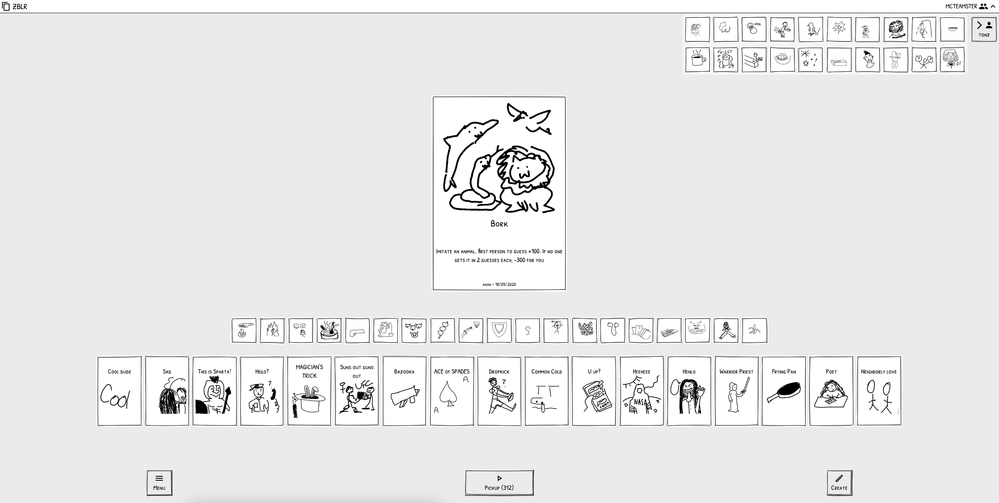

# Blank White Cards
### Play Now: https://blankwhite.cards

## About
This is [1000 Blank White Cards](https://en.wikipedia.org/wiki/1000_Blank_White_Cards) online. A social party game sandbox where you make the rules. Best played with friends around a table or on video call.

Connect to the same Multiplayer Room to draw cards together using a common DECK.
Put your cards on the PILE for everyone to see in real-time!
Or maybe keep them hidden in your HAND, or even displayed on the TABLE in front of you.

Browse the Global Deck in Single Device mode for a local pass-and-play experience.
Create and submit cards there for the whole world to see!

### History
Version `1.x` of this game was originally made in late 2019 and enjoyed at house parties - hotseat style - before the pandemic. Online multiplayer was added in 2020. With lots of time on their hands, players from around the world published hundreds of cards to the Global Deck (and made many more in custom games)!

The first version was written MVC style with a HTML `jQuery` based frontend, `express` REST API on `nodejs12.x`, and `mongodb`. Full-stack development has come a long way since then and the game needed a well-deserved refresh.

It's honestly amazing that so many people have contributed so far, and even more impressive that the quality of content remains high. Over time some themes in the cards emerged like:
- Gaining Points
- Drinking Shots
- Annoying Your Friends
- Making Weird Noises

### What's New
Some meta-actions which were previously bound by technical limitations are now possible in version `2.x` with features like:
- Hand: Picking Up and Discarding
- Table: Placing cards in front of you (e.g. for long-lived/dormant/persistent actions/buffs/debuffs)
- Sending cards between players: you can only send cards in your Hand or on your Table
- Card creation on demand: Blanks no longer show up randomly. New cards go into your hand.

Other quality of life improvements include:
- The Deck draws without replacement (can be reshuffled)
- Improved RNG: card popularity no longer affects chance of appearance
- Browse the main Pile's history (and general browsing UI)
- A separate Discard Pile (hidden from view)
- Card ownership: and the ability to transfer between locations

Other noteworthy features:
- [Card Gallery:](https://blankwhite.cards/card) now with search!
- New Save / Load format: with backwards compatibility for decks made in `1.x`!
- A new Multiplayer Lobby experience: share and join links with QR codes
- Session memory and persistence
- Custom image compression for faster multiplayer performance

This new version is made in React TypeScript and uses [`boardgame.io`](https://boardgame.io/) as the game engine and networking stack. [Writing your own multiplayer networking code](https://github.com/mcteamster/twinge?tab=readme-ov-file#twinge-service) is tricky, and `bgio` made it a breeze.

## More Docs
[Infrastructure:](./docs/aws.md)
The game is hosted on AWS almost entirely within the Free Tier.
Take a look if you're wondering how it's done.

[Self-Hosting Guide:](./docs/local.md)
The internet can be too big and scary of a place to send your precious creations.
You're welcome to run your own instance of `Blank White Cards` locally if you wish.

[Image Processing:](./docs/images.md)
Card images are standardised and compressed to maximise network performance with minimal gameplay impact. Learn more about the custom algorithm implemented here.

## License
Blank White Cards game software code freely available under [MIT License](./LICENSE.md)

Cards submitted to the Global Deck published under [Creative Commons CC BY 4.0](https://creativecommons.org/licenses/by/4.0/)

## Credits
Package | Source | License | Attribution
--- | --- | --- | ---
[Boardgame.io](https://boardgame.io/) | https://github.com/boardgameio/boardgame.io | MIT | Copyright (c) 2017 The boardgame.io Authors.
[Wired Elements](https://wiredjs.com/) | https://github.com/rough-stuff/wired-elements | MIT | Copyright (c) 2021 Preet Shihn
[Atrament](https://www.fiala.space/atrament/) | https://github.com/jakubfiala/atrament | MIT | Copyright 2024 Jakub Fiala
[Patrick Hand SC](https://fonts.google.com/specimen/Patrick+Hand+SC/license) | - | SIL Open Font License | Copyright (c) 2010-2012 Patrick Wagesreiter