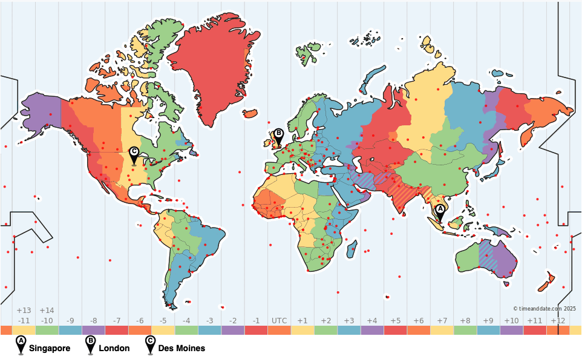

# AWS Hosting Architecture
The game is hosted on AWS using the following services:
- CloudFront for the Web App
- AppRunner and EC2 for the `boardgame.io` Game Servers in multiple regions
- API Gateway, SQS, and Lambda for the Global Card Creation and 'Like' API

Region distribution has been chosen to cover most of the world's landmass using 3 servers spaced at about 90 degree longitude intervals.

This keeps interaction latencies around 0.5-1 second on average for major population centres, and 2 seconds at most.

| Geo | AWS Region |
| --- | --- |
| North America | us-east-1 (Northern Virginia) |
| Europe | eu-central-1 (Frankfurt) |
| Asia Pacific | ap-southeast-1 (Singapore) |

