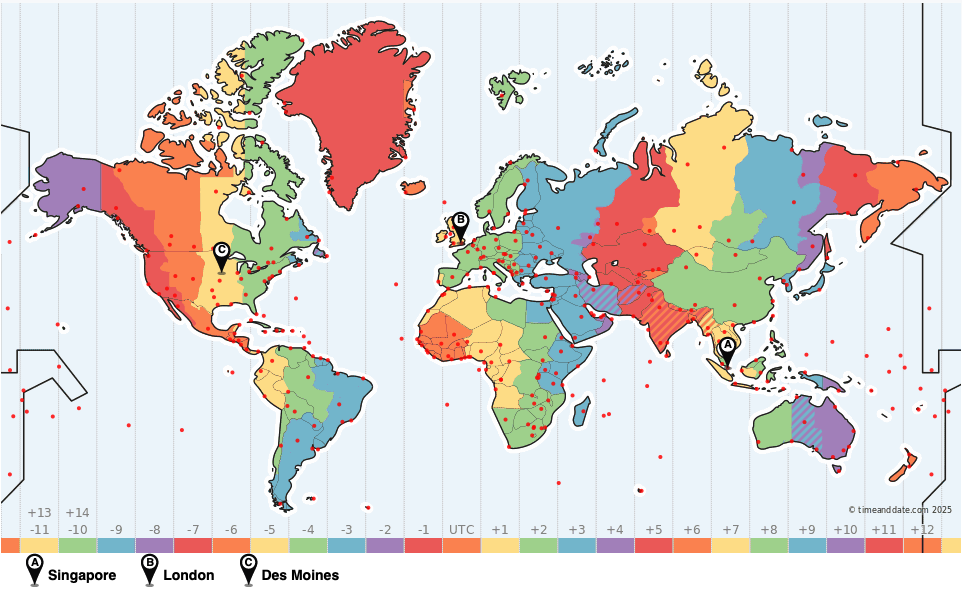

# AWS Hosting Architecture
The game is hosted on AWS using the following services:
- AWS CloudFront for the Web App
- AWS API Gateway, SQS, and Lambda for the Global Card Creation and 'Like' API
- Virtual Machines for the `boardgame.io` Game Servers in multiple regions
  - Asia Pacific: AWS EC2
  - Europe: Azure VM
  - North America: GCP CE

Region distribution has been chosen to cover most of the world's landmass using 3 servers spaced at about 90 degree longitude intervals.

This keeps interaction latencies around 0.5-1 second on average for major population centres, and 2 seconds at most.

| Geo | Cloud Region |
| --- | --- |
| North America | GCP us-central1 (Iowa) |
| Europe | Azure UK South (London) |
| Asia Pacific | AWS ap-southeast-1 (Singapore) |

