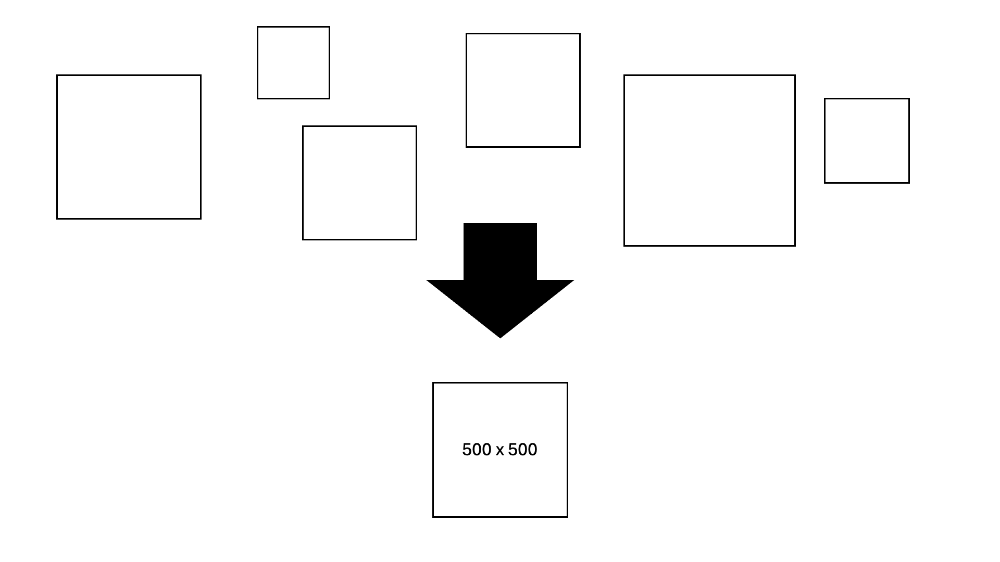
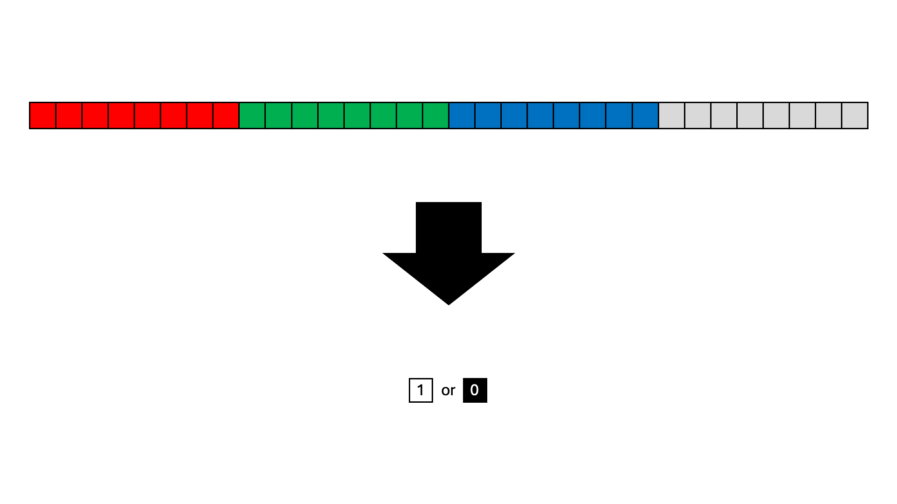
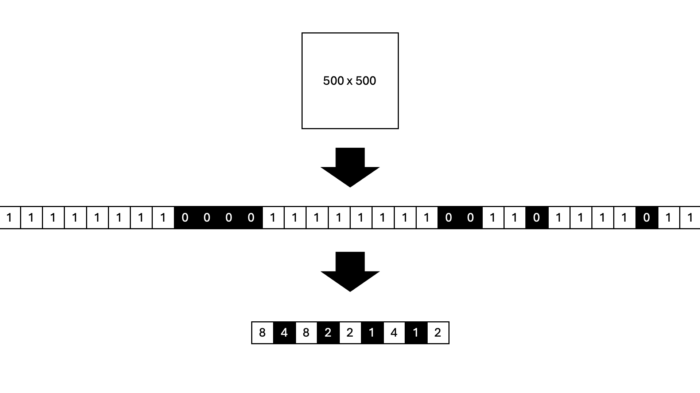
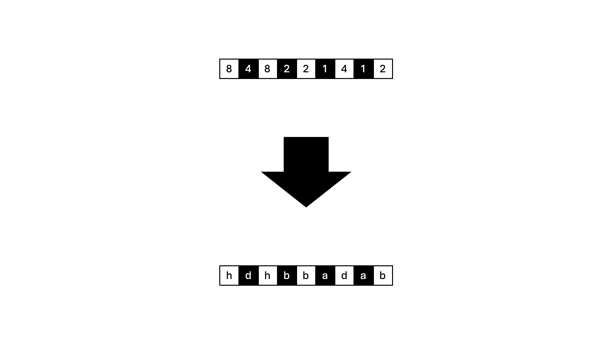

# Image Processing
The nature of this game demands real-time low-latency network transfer for a lot of images. Here are some of the tricks and hacks that make the game as responsive as possible.

### Monochrome
When creating cards you'll notice that the canvas only lets you draw in black (on a white background). Consider it an aesthetic decision. This has always been the case since version 1, and helps with resulting output `.png` image's built-in compression.

### Standard Resolution
The size of displayed images as well as the sketchpad canvas adapt dynamically to the player's screen. Originally, this directly influenced the size of created images. As a result, cards could have wildly differernt resolutions and file sizes.

The base64 data URI encoding of the PNG has varied in length from only a few hundred characters to over `100kB` on occasion.

Because there was no bound on the size of a card's image, there have even been instances where cards made on high-resolution computer screens were too large to process.

Aside from that, size wasn't too much of an issue previously, because only one card was ever displayed at a time. However, now with Hands, the Table and the Pile, hundreds of cards might need to be rendered simultaneously.

A standardised resolution of 500px by 500px is now applied to newly submitted cards. This value is small enough to process rapidly, whilst preserving enough fidelity when upscaled to larger screens.

### 1-Bit Colour
The canvas context has a 24-bit colour depth with a 8-bit alpha channel per pixel. This is 2,147,483,648 times more granularity than we actually need to represent a black and white card image.

During the image resizing step, the Red Blue and Green bytes are normalised to either 255 (white) or 0 (black) based on whether their mean value is above or below the median (< 128). The alpha channel is left as opaque. This is not the most accurate method for [Luma](https://en.wikipedia.org/wiki/Luma_(video)) calculation, but is certainly the fastest and most practical for the expected high-contrast input data.

Reducing the colour depth to 1-bit means that the picture can then be represented as a stream of 1s (for white) and 0s (for black). In conjunction with the standard 500px square resolution, this means images should now have a maximum theoretical limit of `250,000 bits` or `30.518kB`.

### Run Length Encoding
In an typical card picture, the array of image bits is generally very sparse; i.e. a long sequence of white pixels interrupted by short bursts of black. 

[Run Length Encoding](https://en.wikipedia.org/wiki/Run-length_encoding) (RLE) is a simple compression algorithm that specifies pairs of `(symbol, number_of_repeats)` as a means of deduplicating large sections of repeated data. 

The 250,000 pixel 1-bit image representation is Run Length Encoded into an array of integers, with an additional optimisation where the odd indices of the array conventionally represent white pixels, and the even indicies represent black (i.e. `colour = (i % 2)`) - further reducing overhead.

The generated arrays tend to only be in the thousands of elements and characters long, so approximately `5-15kB`.

### Huffman Coding
Inspecting the RLE arrays revealed a skew towards commonly occurring run length values. This is due to the scan pattern of the image being line by line, and the sketchpad brush width being 4 pixels (before resizing). Numbers like `3, 4, 5, 6` and `494, 495, 496, 497` appear very frequenly because of vertical lines in the drawing.

[Huffman Coding](https://en.wikipedia.org/wiki/Huffman_coding) is a compression technique that maps more common values to keys that can be represented in fewer bits. The output is a frequency map that accompanies a sequence array. Combining algorithms like RLE and Huffman Coding is similar to the basis of general compression technologies like `gzip`.

However, after implementing Huffman Coding for the RLE array, it was observed that the improvements in compression were not reliable enough to sufficiently offset the overheads of introducing the frequency map into the format, so it has not been used.

### UTF-16 Encoding
`UTF-16` is a standard for character encoding on the web, and takes up 1-2 bytes per character.

Additionally `boardgame.io` requires the gamestate object to be `JSON` serialisable. Stringifying javascript `objects` and `arrays` with many elements adds noticable bloat, (due to all the extra quotes `"` colons `:` and commas `,`).

A JSON serialised javascript object with multi-digit numbers will also encode each digit as its own character byte. Since one byte can represent numbers up to 255, this becomes wasteful from two-digit numbers onwards, which are very common in the RLE array.

These factors are simultaneously addressed by transforming the RLE array into a string of characters corresponding to the UTF-16 character code of the run value (plus an offset of `32` to avoid non-printable ASCII characters).

Run values of `223` and under take up 1 byte, and walues between `224-65503` take up two. Run lengths over `65503` are broken down into multiple runs to keep the resulting character under 16 bits for encoding compatibility. Run values of this size are outliers and take up at least a quarter of the image, which reduces the overall RLE array size anyway. 

These raw UTF-16 strings tend to be at most `a few kilobytes` and reliably beat built-in `.png` compression by at least a factor of 2.

### Compression Ratios
The Global Deck was upgraded to used compression in March 2025. Data from the 392 cards at the time:

Compression Ratios | Median | Mean | StdDev | Range
--- | --- | --- | --- | ---
All Cards | `4.191:1` | `20.459:1` | `88.755` | `1.943-538.370`
Outliers Excluded | `4.1085:1` | `5.403:1` | `6.064:1` | `1.943-60.907`

Prior to processing, the mean uncompressed, non-normalised, card using a PNG Data URI was `22kB`

After processing, the mean compressed card was `3.727kB`

Method | Size 
--- | ---
Unrestricted Monochrome PNG (v1) | `up to >100kB`
500x500 True-Colour Bitmap | `976.563kB`
500x500 1-Bit Colour Bitmap | `30.518kB`
500x500 1-Bit Run Length Encoded | `5-15kB`
500x500 1-Bit RLE UTF-16 | `~4kB`